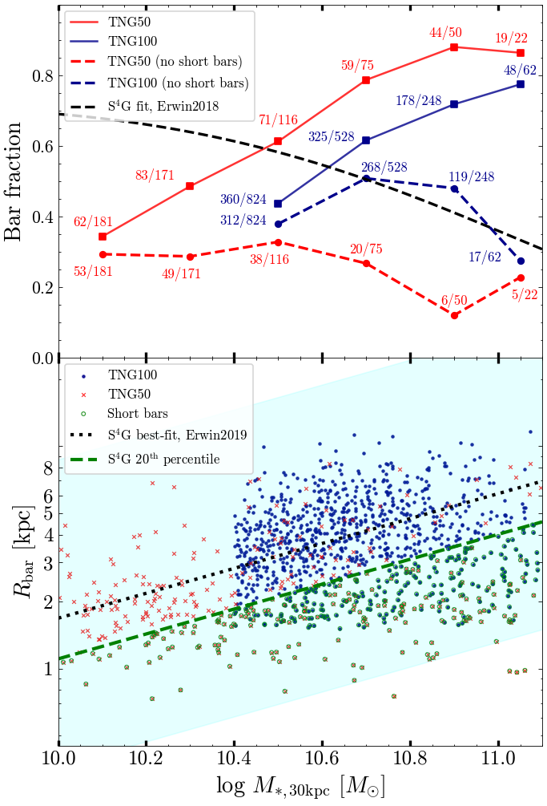
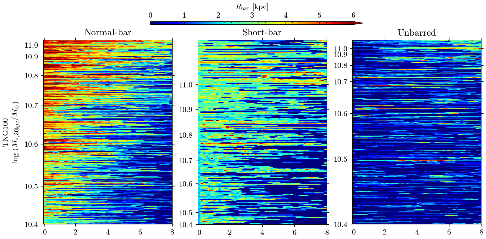
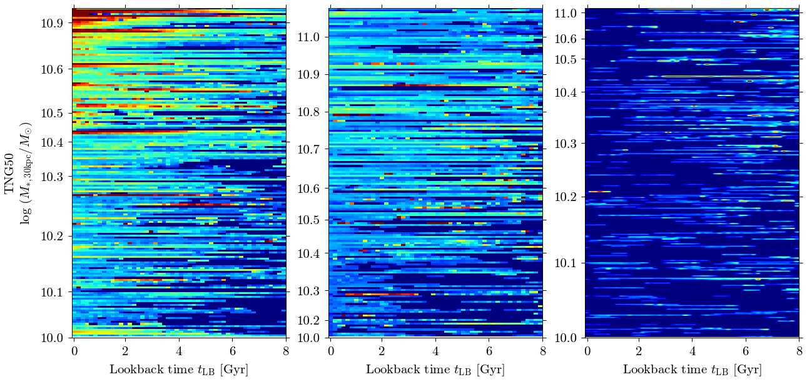

### Data and notebooks for TNG bars

This Git repository contains data files and Python Jupyter notebooks used to reproduce figures and analyses from the paper:  
["IllustrisTNG Insights: Factors Affecting the Presence of Bars in Disk Galaxies"](https://arxiv.org/abs/2412.02255) ([arXiv:2412.02255](https://arxiv.org/abs/2412.02255)).

The `data/` subdirectory contains:

- `tng50-1_bar_size.hdf5`: Galaxy bar size evolution in TNG50 for disk galaxies ($\kappa_{\rm rot} \geq 0.5$) with $\log(M_*/M_{\odot}) = 10.0$–$11.1$, from Snapshot 50 ($z = 1$) to Snapshot 99 ($z = 0$).

- `tng100-1_bar_size.hdf5`: Galaxy bar size evolution in TNG100 for disk galaxies ($\kappa_{\rm rot} \geq 0.5$) with $\log(M_*/M_{\odot}) = 10.4$–$11.1$, from Snapshot 50 ($z = 1$) to Snapshot 99 ($z = 0$).

- `s4gbars_table.dat`: Bar statistics from Erwin (2018), "The Dependence of Bar Frequency on Galaxy Mass, Colour, and Gas Content — and Angular Resolution — in the Local Universe," *Monthly Notices of the Royal Astronomical Society*, **474:** 5372; [arXiv:1711.04867](https://arxiv.org/abs/1711.04867).

### Figures

*This figure shows the variation of bar fraction ($f_{\rm bar}$, upper) and bar size distribution ($R_{\rm bar}$, lower) with stellar mass ($M_{*,30\,\mathrm{kpc}}$) for galaxies in TNG100 (blue) and TNG50 (red).*

*Evolution of bar size (color-coded) for barred (left), short-bar (middle), and unbarred (right) galaxies in TNG100 (top row) and TNG50 (bottom row). Each row in a panel represents the bar size of an individual galaxy as a function of lookback time ($t_{\rm LB}$), sorted by stellar mass.*